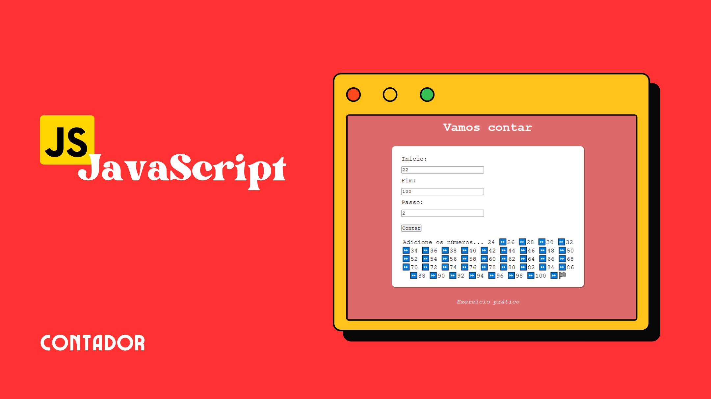

<h1 align="center">#TREINO JAVASCRIPT 3</h1>
<h2 align="center">Contador</h2>

  Página Contador de Números

  <a href="#-tecnologias">Tecnologias</a>&nbsp;&nbsp;&nbsp;|&nbsp;&nbsp;&nbsp;
  <a href="#-projeto">Projeto</a>&nbsp;&nbsp;&nbsp;|&nbsp;&nbsp;&nbsp;
  <a href="#-layout">Layout</a>&nbsp;&nbsp;&nbsp;|&nbsp;&nbsp;&nbsp;

  

 

  

## 🚀 Tecnologias
- HTML: Linguagem de marcação para estruturar o conteúdo da página.
- CSS: Estilização do site.
- JavaScript: Implementado para interações dinâmicas na página.

## 💻 Projeto
Permite a contagem dinâmica, com o usuário definindo o início, o fim e o passo da sequência. Ele inclui validações para campos não preenchidos ou valores inválidos, exibindo alertas apropriados. Utilizando loops while, o código realiza a contagem, considerando diferentes cenários, como contagem crescente ou regressiva, e trata condições específicas, como passo menor ou igual a zero e números muito grandes. O resultado é exibido dinamicamente na página HTML, encerrando com um emoji de bandeira de chegada para indicar o término. 

- Você pode visualizar o layout do projeto através [DESSE LINK](<https://jasonaraujo1.github.io/TreinoJavaScript-3/>). 

## :memo: Licença

Esse projeto está sob a licença MIT.

---

Instruções pela [Sua Empresa/Equipe](https://seusite.com) :wave: [Participe da nossa comunidade!](https://discord.gg/sua-comunidade)
